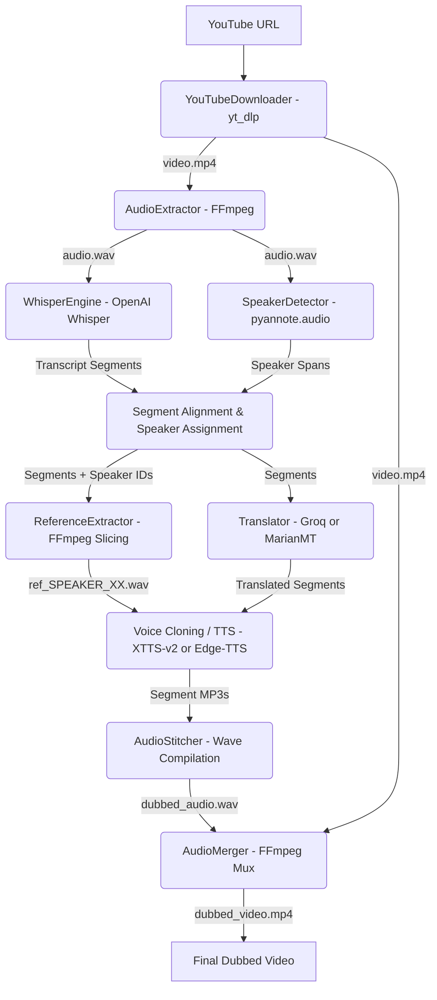

# YouTube AI Dubbing System: Architectural & Codebase Report

This document provides a detailed overview of the project structure, design patterns, module-by-module roles, and core algorithms within the **YouTube AI Dubbing System**.

---

## 1. System Architecture Overview

The system uses a sequential modular pipeline pattern (Pipes and Filters architecture) coordinated through a single runner. The pipeline handles:
1. Downloading source media and extracting high-fidelity audio.
2. Generating timestamped transcriptions.
3. Performing speaker diarization (speaker identification) to identify who is speaking.
4. Extracting speaker voice references.
5. Translating source text with windowed context preservation.
6. Generating speech (TTS/Voice Cloning) and aligning it dynamically to the original pacing.
7. Multiplexing (muxing) the dubbed audio back into the original video.

Here is the data flow and execution sequence diagram:



---

## 2. Codebase Structure

Below is the directory hierarchy of the project with details on each path:

```
youtube-ai-dubbing-system/
│
├── .env                       # Environment variables (API keys, models, configurations)
├── .env.example               # Standard template for env configurations
├── config.py                  # Central configuration registry and validation constants
├── main.py                    # Application CLI entrypoint (supports single URL, file lists, batch mode)
│
├── pipeline/
│   ├── __init__.py
│   └── runner.py              # Main Orchestration Module for the dubbing pipeline
│
├── downloader/
│   ├── __init__.py
│   └── youtube.py             # YouTube video stream downloading wrapper using yt-dlp
│
├── audio/
│   ├── __init__.py
│   ├── extractor.py           # FFmpeg wrapper to extract mono audio wav at 16kHz
│   ├── converter.py           # Format normalization (MP3 to PCM wav conversions)
│   └── merger.py              # FFmpeg multiplexer to mux final dubbed WAV into downloaded video
│
├── transcription/
│   ├── __init__.py
│   └── whisper_engine.py      # OpenAI Whisper Speech-to-Text inference wrapper
│
├── diarization/
│   ├── __init__.py
│   ├── models.py              # Speaker segment data structures
│   └── speaker_detector.py    # Pyannote.audio wrapper for speaker diarization
│
├── voice_cloning/
│   ├── __init__.py
│   ├── base.py                # Abstract Base Class for voice cloning cloner instances
│   ├── embedding_cache.py     # In-memory speaker latent caching system to avoid XTTS re-computation
│   ├── reference_extractor.py # Slices longest contiguous speaker spans for voice references
│   ├── voice_cloning_factory.py # Extensible registry for cloning providers
│   └── xtts_cloner.py         # Coqui XTTS-v2 zero-shot voice cloning provider
│
├── translation/
│   ├── __init__.py
│   ├── base.py                # Abstract Base Class for translators (MarianMT, Groq, etc.)
│   ├── translator.py          # Unified wrapper & fallback mechanism using the Strategy Pattern
│   ├── context_builder.py     # Windows transcript segments for semantic translation cohesion
│   ├── groq.py                # Groq API LLM translation provider
│   ├── marian_translator.py   # Local offline MarianMT translation provider
│   └── text_splitter.py       # Helper tools to parse and segment translated texts
│
├── tts/
│   ├── __init__.py
│   ├── provider.py            # Abstract Base Class for TTS engines
│   ├── factory.py             # Singleton provider registry loading edge or xtts providers
│   ├── tts_engine.py          # SegmentTTS coordinator: TTS generation + sync loop
│   ├── edge_provider.py       # Microsoft Edge-TTS async provider wrapper
│   ├── xtts_provider.py       # Coqui XTTS-v2 model loader, SpeechBrain lazy-bypass, fast-synthesizer
│   └── voice_selector.py      # Selects matching voice configurations for speakers/languages
│
├── timing/
│   ├── __init__.py
│   ├── duration.py            # FFprobe duration checks and segment expected length calculation
│   ├── sync.py                # Dynamic synchronization feedback logic (none, pad, speed)
│   └── audio_stitcher.py      # Compiles individual WAV segments into unified audio timelines
│
├── emotion/
│   ├── __init__.py
│   └── emotion_detector.py    # Heuristic and punctuation-aware segment emotion classifier
│
├── media_quality/
│   ├── __init__.py
│   ├── loudness_normalizer.py # LUFS normalization checks (EBU R128)
│   ├── background_music.py    # Background music extraction & ducking logic
│   ├── noise_reduction.py     # Spectral noise gating utilities
│   ├── vocal_isolation.py     # Spleeter / Demucs-based vocal extractor
│   └── lip_sync.py            # Wav2Lip / SadTalker visual lip synchronization interface
│
├── models/
│   ├── __init__.py
│   └── segment.py             # Core Data Models: TranscriptSegment and SegmentAudio
│
├── batch/
│   ├── __init__.py
│   └── batch_runner.py        # Coordinates multiple dubbing tasks for URL batches or list files
│
└── logs/, outputs/, downloads/, temp/ # Auto-generated cache and media output directories
```

---

## 3. Main Dubbing Orchestration Module: `pipeline/runner.py`

The main orchestration module coordinates each subsystem. It takes a YouTube URL, directs the pipeline stages sequentially, and handles state passing.

### Data Models
Information is passed across modules in a structured list of `TranscriptSegment` objects defined in [models/segment.py](file:///c:/Users/pooja/Projects/youtube-ai-dubbing-system/models/segment.py):

*   **`TranscriptSegment`**:
    *   `start`: Start timestamp of segment in seconds.
    *   `end`: End timestamp of segment in seconds.
    *   `original_text`: String transcribed by Whisper.
    *   `translated_text`: Translated string.
    *   `metadata`: Context dict storing speaker ID (`metadata["speaker"]`), emotion (`metadata["emotion"]`), and reference audio path (`metadata["reference_audio"]`).
    *   `audio`: A `SegmentAudio` instance holding details about generated audio.
*   **`SegmentAudio`**:
    *   `file_path`: Absolute path to segment's generated MP3 file.
    *   `expected_duration`: Length of original segment (`end - start`).
    *   `actual_duration`: Length of generated TTS audio file via FFprobe.
    *   `timing_difference`: Difference (`actual - expected`).
    *   `sync_action`: Action selected (`none`, `pad`, or `speed`).

### Orchestration Steps inside `run_pipeline(url)`

1.  **Download and Extract**:
    ```python
    video_path = downloader.download(url)
    audio_path = extractor.extract(video_path)
    ```
    Uses `yt-dlp` to fetch streams and FFmpeg to downmix audio to a standardized mono 16kHz WAV.

2.  **Transcription**:
    ```python
    segments = transcriber.transcribe_segments(audio_path)
    ```
    Whisper analyzes the raw wave, outputting timestamped `TranscriptSegment` chunks.

3.  **Speaker Diarization (Optional / Config-Gated)**:
    ```python
    detector = SpeakerDetector()
    speaker_segments = detector.detect(audio_path)
    detector.assign_speakers_to_segments(segments, speaker_segments)
    ```
    If enabled, Pyannote determines speaker active boundaries. The overlaps are mapped back into the transcript segment metadata dictionary as `segment.metadata["speaker"]`.

4.  **Speaker Reference Audio Extraction**:
    ```python
    extractor = ReferenceExtractor()
    speaker_refs = extractor.extract_speakers_references(audio_path, speaker_segments)
    ```
    Iterates over identified speakers, locating their longest contiguous verbal segment, and uses FFmpeg to slice a clean reference WAV. This reference file is assigned as `segment.metadata["reference_audio"]`.

5.  **Translation**:
    ```python
    translator = Translator()
    translated_segments = translator.translate_segments(segments)
    ```
    Translates source segments, preserving conversational flows using context windows.

6.  **Text-to-Speech Generation & Dynamic Adjustment**:
    ```python
    segment_tts = SegmentTTS()
    for index, segment in enumerate(translated_segments, start=1):
        segment.audio = segment_tts.generate_segment(segment, index)
    ```
    Calls the Text-To-Speech engine. This step includes timing validation and re-generation speed adjustments.

7.  **Audio Stitching and Video Muxing**:
    ```python
    stitcher = AudioStitcher()
    dubbed_audio_path = stitcher.stitch(translated_segments, stitched_wav_path)
    dubbed_video = merger.merge_audio(...)
    ```
    Assembles segments into a cohesive timeline using PCM byte streams, adds silence padding, and merges the audio track with the downloaded video using FFmpeg.

---

## 4. Key Submodules & Architectural Mechanisms

### 4.1. Translation Strategy & Context Windowing
*   **Module**: [translation/translator.py](file:///c:/Users/pooja/Projects/youtube-ai-dubbing-system/translation/translator.py)
*   **Design Pattern**: Strategy Pattern (`BaseTranslator` with `MarianTranslator` and `GroqTranslator` subclasses) and Factory Pattern (`get_translator()`).
*   **Context Preservation**: To prevent disjointed sentence translations, [translation/context_builder.py](file:///c:/Users/pooja/Projects/youtube-ai-dubbing-system/translation/context_builder.py) merges neighboring segments into overlapping context windows before submitting them to translation providers. After translating the group, it redistributes the translations proportionally back into individual segments.
*   **Fallback Handling**: If the primary translator (e.g. Groq cloud API) fails due to rate limits or API connectivity issues, it catches the error and switches to the local Hugging Face `MarianMT` translator.

### 4.2. Dynamic Audio Synchronization
*   **Modules**: [timing/sync.py](file:///c:/Users/pooja/Projects/youtube-ai-dubbing-system/timing/sync.py) & [tts/tts_engine.py](file:///c:/Users/pooja/Projects/youtube-ai-dubbing-system/tts/tts_engine.py)
*   **Problem**: Translated sentences often differ in length compared to source sentences (e.g., German is roughly 20-30% longer than English).
*   **Solution**:
    1.  The actual duration of generated TTS is compared with the original segment boundaries (`end - start`).
    2.  An alignment action is calculated based on three levels:
        *   **Level 1 (Within Tolerance)**: If the duration difference is less than `SYNC_TOLERANCE_MS` (default 100ms), no action is taken (`none`).
        *   **Level 2 (Audio is Shorter)**: Mark as `pad`. The [AudioStitcher](file:///c:/Users/pooja/Projects/youtube-ai-dubbing-system/timing/audio_stitcher.py) inserts silence frames (`0x00`) to fill the remaining time.
        *   **Level 3 (Audio is Longer)**: The system automatically triggers the `speed` action. It calculates the necessary speedup percentage:
            $$\text{speedup} = \left(\frac{\text{actual}}{\text{expected}} - 1.0\right) \times 100$$
            This value is capped at `MAX_TTS_RATE_CHANGE` (default 15%) to avoid voice distortion. The TTS engine then regenerates the segment with this speedup factor.

### 4.3. High-Performance Voice Cloning with Embedding Caching
*   **Modules**: [voice_cloning/embedding_cache.py](file:///c:/Users/pooja/Projects/youtube-ai-dubbing-system/voice_cloning/embedding_cache.py) & [tts/xtts_provider.py](file:///c:/Users/pooja/Projects/youtube-ai-dubbing-system/tts/xtts_provider.py)
*   **Problem**: Extracting speaker conditioning latents (embeddings) for zero-shot voice cloning in XTTS-v2 is computationally expensive. Running it for every segment causes significant pipeline latency.
*   **Solution**:
    *   The `EmbeddingCache` stores the computed conditioning latent tensors in memory:
        ```python
        latents = tts_model.get_conditioning_latents(str(reference_wav_path))
        self._cache[speaker_id] = (gpt_cond_latent, speaker_embedding)
        ```
    *   Subsequent segments for the same speaker skip latent extraction and invoke the model's low-level inference directly:
        ```python
        outputs = self.tts_model.inference(
            text=text,
            language=short_lang,
            gpt_cond_latent=gpt_cond_latent,
            speaker_embedding=speaker_embedding
        )
        ```
*   **System Workaround**: Coqui TTS imports `librosa`, which scans all sys.modules and crashes on SpeechBrain 1.x's lazy-load placeholders. To resolve this, `XTTSProvider` programmatically clears SpeechBrain lazy-load placeholders from `sys.modules` before importing Coqui TTS.
*   **Fallback Handling**: If XTTS voice cloning fails, the pipeline switches to Edge-TTS.

---

## 5. Timeline Compilation & Muxing

### PCM Wav Timeline Stitcher
*   **Module**: [timing/audio_stitcher.py](file:///c:/Users/pooja/Projects/youtube-ai-dubbing-system/timing/audio_stitcher.py)
*   Instead of repeatedly running FFmpeg commands to concatenate audio tracks, the system converts individual segment MP3 files into a standardized PCM WAV layout (16-bit, 16kHz, mono).
*   It opens a single output wave file stream, calculates frame positions based on segment start timestamps, writes empty silence frames (`0x00`) to fill any gaps, and appends the raw byte frames of each segment directly.

### Production Video Muxer
*   **Module**: [audio/merger.py](file:///c:/Users/pooja/Projects/youtube-ai-dubbing-system/audio/merger.py)
*   Once the complete `dubbed_audio.wav` is stitched, FFmpeg merges it back with the original video:
    ```bash
    ffmpeg -i video.mp4 -i dubbed_audio.wav -map 0:v:0 -map 1:a:0 -c:v copy -c:a aac -ar 48000 -ac 2 -movflags +faststart dubbed_video.mp4
    ```
    *   `-c:v copy` performs a lossless stream copy of the original video tracks.
    *   `-c:a aac` encodes the dubbed audio track to standard AAC format, upsampled to 48kHz stereo.
    *   `-movflags +faststart` shifts index metadata to the front of the file, enabling progressive rendering for web playback.
